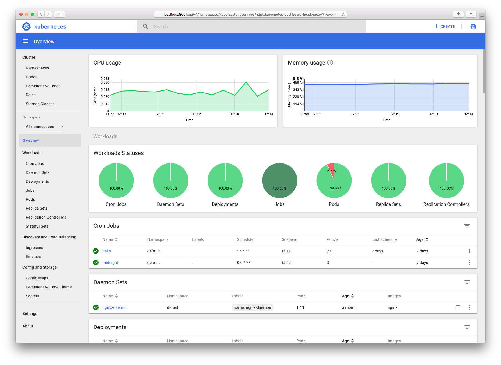

# 集群狀態異常排錯

本章介紹集群狀態異常的排錯方法，包括 Kubernetes 主要組件以及必備擴展（如 kube-dns）等，而有關網絡的異常排錯請參考[網絡異常排錯方法](network.md)。

## 概述

排查集群狀態異常問題通常從 Node 和 Kubernetes 服務 的狀態出發，定位出具體的異常服務，再進而尋找解決方法。集群狀態異常可能的原因比較多，常見的有

* 虛擬機或物理機宕機
* 網絡分區
* Kubernetes 服務未正常啟動
* 數據丟失或持久化存儲不可用（一般在公有云或私有云平臺中）
* 操作失誤（如配置錯誤）

按照不同的組件來說，具體的原因可能包括

* kube-apiserver 無法啟動會導致
  * 集群不可訪問
  * 已有的 Pod 和服務正常運行（依賴於 Kubernetes API 的除外）
* etcd 集群異常會導致
  * kube-apiserver 無法正常讀寫集群狀態，進而導致 Kubernetes API 訪問出錯
  * kubelet 無法週期性更新狀態
* kube-controller-manager/kube-scheduler 異常會導致
  * 複製控制器、節點控制器、雲服務控制器等無法工作，從而導致 Deployment、Service 等無法工作，也無法註冊新的 Node 到集群中來
  * 新創建的 Pod 無法調度（總是 Pending 狀態）
* Node 本身宕機或者 Kubelet 無法啟動會導致
  * Node 上面的 Pod 無法正常運行
  * 已在運行的 Pod 無法正常終止
* 網絡分區會導致 Kubelet 等與控制平面通信異常以及 Pod 之間通信異常

為了維持集群的健康狀態，推薦在部署集群時就考慮以下

* 在雲平臺上開啟 VM 的自動重啟功能
* 為 Etcd 配置多節點高可用集群，使用持久化存儲（如 AWS EBS 等），定期備份數據
* 為控制平面配置高可用，比如多 kube-apiserver 負載均衡以及多節點運行 kube-controller-manager、kube-scheduler 以及 kube-dns 等
* 儘量使用複製控制器和 Service，而不是直接管理 Pod
* 跨地域的多 Kubernetes 集群

## 查看 Node 狀態

一般來說，可以首先查看 Node 的狀態，確認 Node 本身是不是 Ready 狀態

```sh
kubectl get nodes
kubectl describe node <node-name>
```

如果是 NotReady 狀態，則可以執行 `kubectl describe node <node-name>` 命令來查看當前 Node 的事件。這些事件通常都會有助於排查 Node 發生的問題。

## SSH 登錄 Node

在排查 Kubernetes 問題時，通常需要 SSH 登錄到具體的 Node 上面查看 kubelet、docker、iptables 等的狀態和日誌。在使用雲平臺時，可以給相應的 VM 綁定一個公網 IP；而在物理機部署時，可以通過路由器上的端口映射來訪問。但更簡單的方法是使用 SSH Pod （不要忘記替換成你自己的 nodeName）：

```yaml
# cat ssh.yaml
apiVersion: v1
kind: Service
metadata:
  name: ssh
spec:
  selector:
    app: ssh
  type: LoadBalancer
  ports:
  - protocol: TCP
    port: 22
    targetPort: 22
---
apiVersion: extensions/v1beta1
kind: Deployment
metadata:
  name: ssh
  labels:
    app: ssh
spec:
  replicas: 1
  selector:
    matchLabels:
      app: ssh
  template:
    metadata:
      labels:
        app: ssh
    spec:
      containers:
      - name: alpine
        image: alpine
        ports:
        - containerPort: 22
        stdin: true
        tty: true
      hostNetwork: true
      nodeName: <node-name>
```

```sh
$ kubectl create -f ssh.yaml
$ kubectl get svc ssh
NAME      TYPE           CLUSTER-IP    EXTERNAL-IP      PORT(S)        AGE
ssh       LoadBalancer   10.0.99.149   52.52.52.52   22:32008/TCP   5m
```

接著，就可以通過 ssh 服務的外網 IP 來登錄 Node，如 `ssh user@52.52.52.52`。

在使用完後， 不要忘記刪除 SSH 服務 `kubectl delete -f ssh.yaml`。

## 查看日誌

一般來說，Kubernetes 的主要組件有兩種部署方法

* 直接使用 systemd 等啟動控制節點的各個服務
* 使用 Static Pod 來管理和啟動控制節點的各個服務

使用 systemd 等管理控制節點服務時，查看日誌必須要首先 SSH 登錄到機器上，然後查看具體的日誌文件。如

```sh
journalctl -l -u kube-apiserver
journalctl -l -u kube-controller-manager
journalctl -l -u kube-scheduler
journalctl -l -u kubelet
journalctl -l -u kube-proxy
```

或者直接查看日誌文件

* /var/log/kube-apiserver.log
* /var/log/kube-scheduler.log
* /var/log/kube-controller-manager.log
* /var/log/kubelet.log
* /var/log/kube-proxy.log

而對於使用 Static Pod 部署集群控制平面服務的場景，可以參考下面這些查看日誌的方法。

### kube-apiserver 日誌

```sh
PODNAME=$(kubectl -n kube-system get pod -l component=kube-apiserver -o jsonpath='{.items[0].metadata.name}')
kubectl -n kube-system logs $PODNAME --tail 100
```

### kube-controller-manager 日誌

```sh
PODNAME=$(kubectl -n kube-system get pod -l component=kube-controller-manager -o jsonpath='{.items[0].metadata.name}')
kubectl -n kube-system logs $PODNAME --tail 100
```

### kube-scheduler 日誌

```sh
PODNAME=$(kubectl -n kube-system get pod -l component=kube-scheduler -o jsonpath='{.items[0].metadata.name}')
kubectl -n kube-system logs $PODNAME --tail 100
```

### kube-dns 日誌

```sh
PODNAME=$(kubectl -n kube-system get pod -l k8s-app=kube-dns -o jsonpath='{.items[0].metadata.name}')
kubectl -n kube-system logs $PODNAME -c kubedns
```

### Kubelet 日誌

查看 Kubelet 日誌需要首先 SSH 登錄到 Node 上。

```sh
journalctl -l -u kubelet
```

### Kube-proxy 日誌

Kube-proxy 通常以 DaemonSet 的方式部署

```sh
$ kubectl -n kube-system get pod -l component=kube-proxy
NAME               READY     STATUS    RESTARTS   AGE
kube-proxy-42zpn   1/1       Running   0          1d
kube-proxy-7gd4p   1/1       Running   0          3d
kube-proxy-87dbs   1/1       Running   0          4d
$ kubectl -n kube-system logs kube-proxy-42zpn
```

## Kube-dns/Dashboard CrashLoopBackOff

由於 Dashboard 依賴於 kube-dns，所以這個問題一般是由於 kube-dns 無法正常啟動導致的。查看 kube-dns 的日誌

```sh
$ kubectl logs --namespace=kube-system $(kubectl get pods --namespace=kube-system -l k8s-app=kube-dns -o name) -c kubedns
$ kubectl logs --namespace=kube-system $(kubectl get pods --namespace=kube-system -l k8s-app=kube-dns -o name) -c dnsmasq
$ kubectl logs --namespace=kube-system $(kubectl get pods --namespace=kube-system -l k8s-app=kube-dns -o name) -c sidecar
```

可以發現如下的錯誤日誌

```sh
Waiting for services and endpoints to be initialized from apiserver...
skydns: failure to forward request "read udp 10.240.0.18:47848->168.63.129.16:53: i/o timeout"
Timeout waiting for initialization
```

這說明 kube-dns pod 無法轉發 DNS 請求到上游 DNS 服務器。解決方法為

- 如果使用的 Docker 版本大於 1.12，則在每個 Node 上面運行 `iptables -P FORWARD ACCEPT` 開啟 Docker 容器的 IP 轉發
- 等待一段時間，如果還未恢復，則檢查 Node 網絡是否正確配置，比如是否可以正常請求上游DNS服務器、是否開啟了 IP 轉發（包括 Node 內部和公有云上虛擬網卡等）、是否有安全組禁止了 DNS 請求等


如果錯誤日誌中不是轉發 DNS 請求超時，而是訪問 kube-apiserver 超時，比如

```sh
E0122 06:56:04.774977       1 reflector.go:199] k8s.io/dns/vendor/k8s.io/client-go/tools/cache/reflector.go:94: Failed to list *v1.Endpoints: Get https://10.0.0.1:443/api/v1/endpoints?resourceVersion=0: dial tcp 10.0.0.1:443: i/o timeout
I0122 06:56:04.775358       1 dns.go:174] Waiting for services and endpoints to be initialized from apiserver...
E0122 06:56:04.775574       1 reflector.go:199] k8s.io/dns/vendor/k8s.io/client-go/tools/cache/reflector.go:94: Failed to list *v1.Service: Get https://10.0.0.1:443/api/v1/services?resourceVersion=0: dial tcp 10.0.0.1:443: i/o timeout
I0122 06:56:05.275295       1 dns.go:174] Waiting for services and endpoints to be initialized from apiserver...
I0122 06:56:05.775182       1 dns.go:174] Waiting for services and endpoints to be initialized from apiserver...
I0122 06:56:06.275288       1 dns.go:174] Waiting for services and endpoints to be initialized from apiserver...
```

這說明 Pod 網絡（一般是多主機之間）訪問異常，包括 Pod->Node、Node->Pod 以及 Node-Node 等之間的往來通信異常。可能的原因比較多，具體的排錯方法可以參考[網絡異常排錯指南](network.md)。

## Node NotReady

Node 處於 NotReady 狀態，大部分是由於 PLEG（Pod Lifecycle Event Generator）問題導致的。社區 issue [#45419](https://github.com/kubernetes/kubernetes/issues/45419) 目前還處於未解決狀態。

NotReady 的原因比較多，在排查時最重要的就是執行 `kubectl describe node <node name>` 並查看 Kubelet 日誌中的錯誤信息。常見的問題及修復方法為：

* Kubelet 未啟動或者異常掛起：重新啟動 Kubelet。
* CNI 網絡插件未部署：部署 CNI 插件。
* Docker 僵死（API 不響應）：重啟 Docker。
* 磁盤空間不足：清理磁盤空間，比如鏡像、臨時文件等。

> Kubernetes node 有可能會出現各種硬件、內核或者運行時等問題，這些問題有可能導致服務異常。而 Node Problem Detector（NPD）就是用來監測這些異常的服務。NPD 以 DaemonSet 的方式運行在每臺 Node 上面，並在異常發生時更新 NodeCondition（比如 KernelDaedlock、DockerHung、BadDisk 等）或者 Node Event（比如 OOM Kill 等）。
>
> 可以參考 [kubernetes/node-problem-detector](https://github.com/kubernetes/kubernetes/tree/master/cluster/addons/node-problem-detector) 來部署 NPD，以便更快發現 Node 上的問題。

## Kubelet: failed to initialize top level QOS containers

重啟 kubelet 時報錯 `Failed to start ContainerManager failed to initialise top level QOS containers `（參考 [#43856](https://github.com/kubernetes/kubernetes/issues/43856)），臨時解決方法是：

1. 在 docker.service 配置中增加 `--exec-opt native.cgroupdriver=systemd` 選項。
2. 重啟主機

該問題已於2017年4月27日修復（v1.7.0+， [#44940](https://github.com/kubernetes/kubernetes/pull/44940)）。更新集群到新版本即可解決這個問題。

## Kubelet 一直報 FailedNodeAllocatableEnforcement 事件

當 NodeAllocatable 特性未開啟時（即 kubelet 設置了 `--cgroups-per-qos=false` ），查看 node 的事件會發現每分鐘都會有 `Failed to update Node Allocatable Limits` 的警告信息：

```sh
$ kubectl describe node node1
Events:
  Type     Reason                            Age                  From                               Message
  ----     ------                            ----                 ----                               -------
  Warning  FailedNodeAllocatableEnforcement  2m (x1001 over 16h)  kubelet, aks-agentpool-22604214-0  Failed to update Node Allocatable Limits "": failed to set supported cgroup subsystems for cgroup : Failed to set config for supported subsystems : failed to write 7285047296 to memory.limit_in_bytes: write /var/lib/docker/overlay2/5650a1aadf9c758946073fefa1558446ab582148ddd3ee7e7cb9d269fab20f72/merged/sys/fs/cgroup/memory/memory.limit_in_bytes: invalid argument
```

如果 NodeAllocatable 特性確實不需要，那麼該警告事件可以忽略。但根據 Kubernetes 文檔 [Reserve Compute Resources for System Daemons](https://kubernetes.io/docs/tasks/administer-cluster/reserve-compute-resources/)，最好開啟該特性：

> Kubernetes nodes can be scheduled to `Capacity`. Pods can consume all the available capacity on a node by default. This is an issue because nodes typically run quite a few system daemons that power the OS and Kubernetes itself. Unless resources are set aside for these system daemons, pods and system daemons compete for resources and lead to resource starvation issues on the node.
>
> The `kubelet` exposes a feature named `Node Allocatable` that helps to reserve compute resources for system daemons. Kubernetes recommends cluster administrators to configure `Node Allocatable` based on their workload density on each node.
>
> ```sh
>       Node Capacity
> ---------------------------
> |     kube-reserved       |
> |-------------------------|
> |     system-reserved     |
> |-------------------------|
> |    eviction-threshold   |
> |-------------------------|
> |                         |
> |      allocatable        |
> |   (available for pods)  |
> |                         |
> |                         |
> ---------------------------
> ```

開啟方法為：

```sh
kubelet --cgroups-per-qos=true --enforce-node-allocatable=pods ...
```

## Kube-proxy: error looking for path of conntrack

kube-proxy 報錯，並且 service 的 DNS 解析異常

```sh
kube-proxy[2241]: E0502 15:55:13.889842    2241 conntrack.go:42] conntrack returned error: error looking for path of conntrack: exec: "conntrack": executable file not found in $PATH
```

解決方式是安裝 `conntrack-tools` 包後重啟 kube-proxy 即可。

## Dashboard 中無資源使用圖表

正常情況下，Dashboard 首頁應該會顯示資源使用情況的圖表，如



如果沒有這些圖表，則需要首先檢查 Heapster 是否正在運行（因為Dashboard 需要訪問 Heapster 來查詢資源使用情況）：

```sh
kubectl -n kube-system get pods -l k8s-app=heapster
NAME                        READY     STATUS    RESTARTS   AGE
heapster-86b59f68f6-h4vt6   2/2       Running   0          5d
```

如果查詢結果為空，說明 Heapster 還未部署，可以參考 https://github.com/kubernetes/heapster 來部署。

但如果 Heapster 處於正常狀態，那麼需要查看 dashboard 的日誌，確認是否還有其他問題

```sh
$ kubectl -n kube-system get pods -l k8s-app=kubernetes-dashboard
NAME                                   READY     STATUS    RESTARTS   AGE
kubernetes-dashboard-665b4f7df-dsjpn   1/1       Running   0          5d

$ kubectl -n kube-system logs kubernetes-dashboard-665b4f7df-dsjpn
```

> 注意：Heapster 已被社區棄用，推薦部署 metrics-server 來獲取這些指標。支持 metrics-server 的 dashboard 可以參考[這裡](https://github.com/kubernetes/dashboard/blob/master/aio/deploy/recommended/kubernetes-dashboard-head.yaml)。

## HPA 不自動擴展 Pod

查看 HPA 的事件，發現

```sh
$ kubectl describe hpa php-apache
Name:                                                  php-apache
Namespace:                                             default
Labels:                                                <none>
Annotations:                                           <none>
CreationTimestamp:                                     Wed, 27 Dec 2017 14:36:38 +0800
Reference:                                             Deployment/php-apache
Metrics:                                               ( current / target )
  resource cpu on pods  (as a percentage of request):  <unknown> / 50%
Min replicas:                                          1
Max replicas:                                          10
Conditions:
  Type           Status  Reason                   Message
  ----           ------  ------                   -------
  AbleToScale    True    SucceededGetScale        the HPA controller was able to get the target's current scale
  ScalingActive  False   FailedGetResourceMetric  the HPA was unable to compute the replica count: unable to get metrics for resource cpu: unable to fetch metrics from API: the server could not find the requested resource (get pods.metrics.k8s.io)
Events:
  Type     Reason                   Age                  From                       Message
  ----     ------                   ----                 ----                       -------
  Warning  FailedGetResourceMetric  3m (x2231 over 18h)  horizontal-pod-autoscaler  unable to get metrics for resource cpu: unable to fetch metrics from API: the server could not find the requested resource (get pods.metrics.k8s.io)
```

這說明 [metrics-server](../addons/metrics.md) 未部署，可以參考 [這裡](../addons/metrics.md) 部署。

## Node 存儲空間不足

Node 存儲空間不足一般是容器鏡像未及時清理導致的，比如短時間內運行了很多使用較大鏡像的容器等。Kubelet 會自動清理未使用的鏡像，但如果想要立即清理，可以使用 [spotify/docker-gc](https://github.com/spotify/docker-gc)：

```sh
sudo docker run --rm -v /var/run/docker.sock:/var/run/docker.sock -v /etc:/etc:ro spotify/docker-gc
```

## /sys/fs/cgroup 空間不足

很多發行版默認的 fs.inotify.max_user_watches 太小，只有 8192，可以通過增大該配置解決。比如

```sh
$ sudo sysctl fs.inotify.max_user_watches=524288
```

## 大量 ConfigMap/Secret 導致Kubernetes緩慢

這是從 Kubernetes 1.12 開始才有的問題，Kubernetes issue: [#74412](https://github.com/kubernetes/kubernetes/issues/74412)。

> This worked well on version 1.11 of Kubernetes. After upgrading to 1.12 or 1.13, I've noticed that doing this will cause the cluster to significantly slow down; up to the point where nodes are being marked as NotReady and no new work is being scheduled.
>
> For example, consider a scenario in which I schedule 400 jobs, each with its own ConfigMap, which print "Hello World" on a single-node cluster would.
>
> - On v1.11, it takes about 10 minutes for the cluster to process all jobs. New jobs can be scheduled.
>
> - On v1.12 and v1.13, it takes about 60 minutes for the cluster to process all jobs. After this, no new jobs can be scheduled.

> This is related to max concurrent http2 streams and the change of configmap manager of kubelet. By default, max concurrent http2 stream of http2 server in kube-apiserver is 250, and every configmap will consume one stream to watch in kubelet at least from version 1.13.x. Kubelet will stuck to communicate to kube-apiserver and then become NotReady if too many pods with configmap scheduled to it. A work around is to change the config http2-max-streams-per-connection of kube-apiserver to a bigger value.

臨時解決方法：為 Kubelet 設置 `configMapAndSecretChangeDetectionStrategy: Cache` （參考 [這裡](https://github.com/kubernetes/kubernetes/pull/74755) ）。

修復方法：升級 Go 版本到 1.12 後重新構建 Kubernetes（社區正在進行中）。修復後，Kubelet 可以 watch 的 configmap 可以從之前的 236 提高到至少 10000。

## Kubelet 內存洩漏

這是從 1.12 版本開始有的問題（只在使用 hyperkube 啟動 kubelet 時才有問題），社區 issue 為 [#73587](https://github.com/kubernetes/kubernetes/issues/73587)。

```
(pprof) root@ip-172-31-10-50:~# go tool pprof  http://localhost:10248/debug/pprof/heap
Fetching profile from http://localhost:10248/debug/pprof/heap
Saved profile in /root/pprof/pprof.hyperkube.localhost:10248.alloc_objects.alloc_space.inuse_objects.inuse_space.002.pb.gz
Entering interactive mode (type "help" for commands)
(pprof) top
2406.93MB of 2451.55MB total (98.18%)
Dropped 2863 nodes (cum <= 12.26MB)
Showing top 10 nodes out of 34 (cum >= 2411.39MB)
      flat  flat%   sum%        cum   cum%
 2082.07MB 84.93% 84.93%  2082.07MB 84.93%  k8s.io/kubernetes/vendor/github.com/beorn7/perks/quantile.newStream (inline)
  311.65MB 12.71% 97.64%  2398.72MB 97.84%  k8s.io/kubernetes/vendor/github.com/prometheus/client_golang/prometheus.newSummary
   10.71MB  0.44% 98.08%  2414.43MB 98.49%  k8s.io/kubernetes/vendor/github.com/prometheus/client_golang/prometheus.(*MetricVec).getOrCreateMetricWithLabelValues
    2.50MB   0.1% 98.18%  2084.57MB 85.03%  k8s.io/kubernetes/vendor/github.com/beorn7/perks/quantile.NewTargeted
         0     0% 98.18%  2412.06MB 98.39%  k8s.io/kubernetes/cmd/kubelet/app.startKubelet.func1
         0     0% 98.18%  2412.06MB 98.39%  k8s.io/kubernetes/pkg/kubelet.(*Kubelet).HandlePodAdditions
         0     0% 98.18%  2412.06MB 98.39%  k8s.io/kubernetes/pkg/kubelet.(*Kubelet).Run
```

```sh
curl -s localhost:10255/metrics | sed 's/{.*//' | sort | uniq -c | sort -nr
  25749 reflector_watch_duration_seconds
  25749 reflector_list_duration_seconds
  25749 reflector_items_per_watch
  25749 reflector_items_per_list
   8583 reflector_watches_total
   8583 reflector_watch_duration_seconds_sum
   8583 reflector_watch_duration_seconds_count
   8583 reflector_short_watches_total
   8583 reflector_lists_total
   8583 reflector_list_duration_seconds_sum
   8583 reflector_list_duration_seconds_count
   8583 reflector_last_resource_version
   8583 reflector_items_per_watch_sum
   8583 reflector_items_per_watch_count
   8583 reflector_items_per_list_sum
   8583 reflector_items_per_list_count
    165 storage_operation_duration_seconds_bucket
     51 kubelet_runtime_operations_latency_microseconds
     44 rest_client_request_latency_seconds_bucket
     33 kubelet_docker_operations_latency_microseconds
     17 kubelet_runtime_operations_latency_microseconds_sum
     17 kubelet_runtime_operations_latency_microseconds_count
     17 kubelet_runtime_operations
```

修復方法：禁止 [Reflector metrics](https://github.com/kubernetes/kubernetes/issues/73587)。

## 參考文檔

* [Troubleshoot Clusters](https://kubernetes.io/docs/tasks/debug-application-cluster/debug-cluster/)
* [SSH into Azure Container Service (AKS) cluster nodes](https://docs.microsoft.com/en-us/azure/aks/aks-ssh#configure-ssh-access)
* [Kubernetes dashboard FAQ](https://github.com/kubernetes/dashboard/wiki/FAQ)
