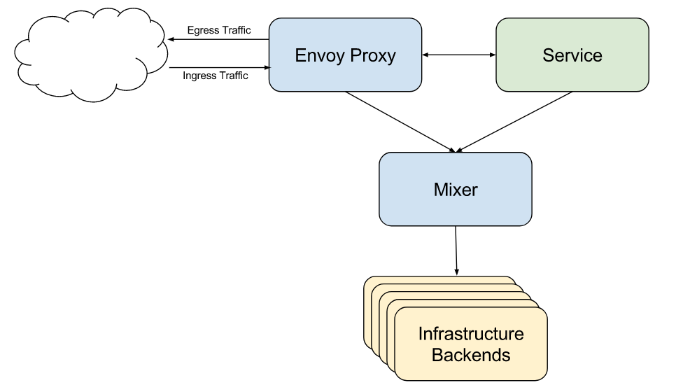

# Istio 策略管理

Mixer 为应用程序和基础架构后端之间提供了一个通用的策略控制层，负责先决条件检查（如认证授权）、配额管理并从 Envoy 代理中收集遥测数据等。



Mixer 支持灵活的插件模型（即 Adapters），支持 GCP、AWS、Prometheus、Heapster 等各种丰富功能的后端。


## 实现原理

本质上，Mixer 是一个 [属性](https://istio.io/docs/concepts/policy-and-control/attributes.html) 处理机，进入 Mixer 的请求带有一系列的属性，Mixer 按照不同的处理阶段处理：

- 通过全局 Adapters 为请求引入新的属性
- 通过解析（Resolution）识别要用于处理请求的配置资源
- 处理属性，生成 Adapter 参数
- 分发请求到各个 Adapters 后端处理


Adapters 后端以 [Mixer 配置](https://istio.io/docs/concepts/policy-and-control/mixer-config.html) 的方式注册到 Istio 中，参考 [这里](https://github.com/istio/istio/tree/master/mixer/testdata/config) 查看示例配置。

## 流量限制示例

```yaml
# Adapter
apiVersion: config.istio.io/v1alpha2
kind: memquota
metadata:
  name: handler
  namespace: istio-system
spec:
  quotas:
  - name: requestcount.quota.istio-system
    # default rate limit is 5000qps
    maxAmount: 5000
    validDuration: 1s
    # The first matching override is applied.
    # A requestcount instance is checked against override dimensions.
    overrides:
    # The following override applies to traffic from 'rewiews' version v2,
    # destined for the ratings service. The destinationVersion dimension is ignored.
    - dimensions:
        destination: ratings
        source: reviews
        sourceVersion: v2
      maxAmount: 1
      validDuration: 1s
---
# Quota
apiVersion: config.istio.io/v1alpha2
kind: quota
metadata:
  name: requestcount
  namespace: istio-system
spec:
  dimensions:
    source: source.labels["app"] | source.service | "unknown"
    sourceVersion: source.labels["version"] | "unknown"
    destination: destination.labels["app"] | destination.service | "unknown"
    destinationVersion: destination.labels["version"] | "unknown"
---
# Rule
apiVersion: config.istio.io/v1alpha2
kind: rule
metadata:
  name: quota
  namespace: istio-system
spec:
  actions:
  - handler: handler.memquota
    instances:
    - requestcount.quota

```

## 参考文档

- [Istio Mixer](https://istio.io/docs/concepts/policy-and-control/mixer.html)

