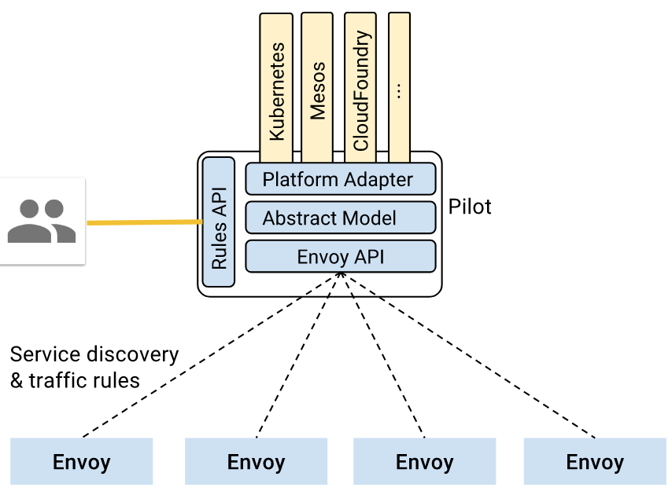

# Istio 流量管理

Istio 提供了强大的流量管理功能，如智能路由、服务发现与负载均衡、故障恢复、故障注入等。


流量管理的功能由 Pilot 配合 Envoy 负责，并接管进入和离开容器的所有流量：




## 服务发现和负载均衡

为了接管流量，Istio 假设所有容器在启动时自动将自己注册到 Istio 中（通过自动或手动给 Pod 注入 Envoy sidecar 容器）。Envoy 收到外部请求后，会对请求作负载均衡，并支持轮询、随机和加权最少请求等负载均衡算法。除此之外，Envoy 还会以熔断机制定期检查服务后端容器的健康状态，自动移除不健康的容器和加回恢复正常的容器。容器内也可以返回 HTTP 503 显示将自己从负载均衡中移除。


## 故障恢复

Istio 提供了一系列开箱即用的故障恢复功能，如

- 超时处理
- 重试处理，如限制最大重试时间以及可变重试间隔
- 健康检查，如自动移除不健康的容器
- 请求限制，如并发请求数和并发连接数
- 熔断

这些功能均可以使用 [RouteRule](https://istio.io/docs/concepts/traffic-management/rules-configuration.html) 动态配置。比如以下配置了并发 100 的连接数：

```yaml
apiVersion: config.istio.io/v1alpha2
kind: DestinationPolicy
metadata:
  name: reviews-v1-cb
spec:
  destination:
    name: reviews
    labels:
      version: v1
  circuitBreaker:
    simpleCb:
       maxConnections: 100
```

熔断示例：

```sh
cat <<EOF | istioctl create -f -
apiVersion: config.istio.io/v1beta1
kind: DestinationPolicy
metadata:
  name: httpbin-circuit-breaker
spec:
  destination:
    name: httpbin
    labels:
      version: v1
  circuitBreaker:
    simpleCb:
      maxConnections: 1
      httpMaxPendingRequests: 1
      sleepWindow: 3m
      httpDetectionInterval: 1s
      httpMaxEjectionPercent: 100
      httpConsecutiveErrors: 1
      httpMaxRequestsPerConnection: 1
EOF
```

## 故障注入

Istio 支持为应用注入故障，以模拟实际生产中碰到的各种问题，包括

- 注入延迟（模拟网络延迟和服务过载）
- 注入失败（模拟应用失效）

这些故障均可以使用 [RouteRule](https://istio.io/docs/concepts/traffic-management/rules-configuration.html) 动态配置。如以下配置 5 秒的延迟以及 10% 的服务失效（HTTP 400）：

```yaml
apiVersion: config.istio.io/v1alpha2
kind: RouteRule
metadata:
  name: ratings-delay-abort
spec:
  destination:
    name: ratings
  match:
    source:
      name: reviews
      labels:
        version: v2
  route:
  - labels:
      version: v1
  httpFault:
    delay:
      percent: 100
      fixedDelay: 5s
    abort:
      percent: 10
      httpStatus: 400
```

## 金丝雀部署


首先部署 bookinfo，并配置默认路由为 v1 版本：

```sh
# 以下命令假设 bookinfo 示例程序已部署，如未部署，可以执行下面的命令
$ kubectl apply -f https://github.com/istio/istio/raw/master/samples/bookinfo/kube/bookinfo.yaml
# 此时，三个版本的 reviews 服务以负载均衡的方式轮询。

# 创建默认路由，全部请求转发到 v1
$ kubectl apply -f https://github.com/istio/istio/raw/master/samples/bookinfo/kube/route-rule-all-v1.yaml

$ kubectl get routerules ratings-default -o yaml
apiVersion: config.istio.io/v1alpha2
kind: RouteRule
metadata:
  clusterName: ""
  name: ratings-default
  namespace: default
  resourceVersion: "1268520"
  selfLink: /apis/config.istio.io/v1alpha2/namespaces/default/routerules/ratings-default
  uid: 4d546ad3-4701-11e8-8148-000d3aa3ed96
spec:
  destination:
    name: ratings
  precedence: 1
  route:
  - labels:
      version: v1
```

示例一：将 10% 请求发送到 v2 版本而其余 90% 发送到 v1 版本

```sh
cat <<EOF | istioctl create -f -
apiVersion: config.istio.io/v1alpha2
kind: RouteRule
metadata:
  name: reviews-default
spec:
  destination:
    name: reviews
  route:
  - labels:
      version: v2
    weight: 10
  - labels:
      version: v1
    weight: 90
EOF
```

示例二：将 jason 用户的请求全部发到 v2 版本

```sh
cat <<EOF | istioctl create -f -
apiVersion: config.istio.io/v1alpha2
kind: RouteRule
metadata:
  name: reviews-test-v2
spec:
  destination:
    name: reviews
  precedence: 2
  match:
    request:
      headers:
        cookie:
          regex: "^(.*?;)?(user=jason)(;.*)?$"
  route:
  - labels:
      version: v2
EOF
```

示例三：全部切换到 v2 版本

```sh
cat <<EOF | istioctl replace -f -
apiVersion: config.istio.io/v1alpha2
kind: RouteRule
metadata:
  name: reviews-default
spec:
  destination:
    name: reviews
  route:
  - labels:
      version: v2
    weight: 100
EOF
```

示例四：限制并发访问

```sh
# configure a memquota handler with rate limits
cat <<EOF | istioctl create -f -
apiVersion: "config.istio.io/v1alpha2"
kind: memquota
metadata:
 name: handlerdefault
 namespace: default
spec:
 quotas:
 - name: requestcount.quota.default
   maxAmount: 5000
   validDuration: 1s
   overrides:
   - dimensions:
       destination: ratings
     maxAmount: 1
     validDuration: 1s
EOF

# create quota instance that maps incoming attributes to quota dimensions, and createrule that uses it with the memquota handler
cat <<EOF | istioctl create -f -
apiVersion: "config.istio.io/v1alpha2"
kind: quota
metadata:
 name: requestcount
 namespace: default
spec:
 dimensions:
   source: source.labels["app"] | source.service | "unknown"
   sourceVersion: source.labels["version"] | "unknown"
   destination: destination.labels["app"] | destination.service | "unknown"
   destinationVersion: destination.labels["version"] | "unknown"
---
apiVersion: "config.istio.io/v1alpha2"
kind: rule
metadata:
 name: quota
 namespace: default
spec:
 actions:
 - handler: handler.memquota
   instances:
   - requestcount.quota
EOF
```

为了查看访问次数限制的效果，可以使用 [wrk](https://github.com/wg/wrk) 给应用加一些压力：

```sh
export BOOKINFO_URL=$(kubectl get po -n istio-system -l istio=ingress -o jsonpath={.items[0].status.hostIP}):$(kubectl get svc -n istio-system istio-ingress -o jsonpath={.spec.ports[0].nodePort})
wrk -t1 -c1 -d20s http://$BOOKINFO_URL/productpage
```

## Istio Ingress

Istio 在部署时会自动创建一个 Ingress 控制器

```sh
$ kubectl -n istio-system get service istio-ingress
NAME            TYPE           CLUSTER-IP     EXTERNAL-IP     PORT(S)                      AGE
istio-ingress   LoadBalancer   10.0.125.189   <pending>       80:32058/TCP,443:32009/TCP   3d
```

在使用时，可以为 Ingress 添加 `kubernetes.io/ingress.class: istio` Annotation 来使用 istio-ingress。

```sh
$ kubectl apply -f <(istioctl kube-inject -f samples/httpbin/httpbin.yaml)
$ cat <<EOF | kubectl create -f -
apiVersion: extensions/v1beta1
kind: Ingress
metadata:
  name: simple-ingress
  annotations:
    kubernetes.io/ingress.class: istio
spec:
  rules:
  - http:
      paths:
      - path: /status/.*
        backend:
          serviceName: httpbin
          servicePort: 8000
      - path: /delay/.*
        backend:
          serviceName: httpbin
          servicePort: 8000
EOF
$ kubectl get ingress simple-ingress -o wide
NAME             HOSTS     ADDRESS                 PORTS     AGE
simple-ingress   *         130.211.10.121          80        1d
$ curl -I http://130.211.10.121/status/200
```

istio-ingress 还支持 TLS：

```sh
$ openssl req -x509 -nodes -days 365 -newkey rsa:2048 -keyout /tmp/tls.key -out /tmp/tls.crt -subj "/CN=foo.bar.com"
$ kubectl create -n istio-system secret tls istio-ingress-certs --key /tmp/tls.key --cert /tmp/tls.crt
$ cat <<EOF | kubectl create -f -
apiVersion: extensions/v1beta1
kind: Ingress
metadata:
  name: secure-ingress
  annotations:
    kubernetes.io/ingress.class: istio
spec:
  tls:
    # 目前不支持 SNI，所以实际上 secretName 直接忽略
    - secretName: istio-ingress-certs
  rules:
  - http:
      paths:
      - path: /status/.*
        backend:
          serviceName: httpbin
          servicePort: 8000
      - path: /delay/.*
        backend:
          serviceName: httpbin
          servicePort: 8000
EOF
```

当然，对 Ingress 流量也一样可以通过 Istio 来管理

```yaml
cat <<EOF | istioctl create -f -
apiVersion: config.istio.io/v1alpha2
kind: RouteRule
metadata:
  name: status-route
spec:
  destination:
    name: httpbin
  match:
    # Optionally limit this rule to istio ingress pods only
    source:
      name: istio-ingress
      labels:
        istio: ingress
    request:
      headers:
        uri:
          prefix: /delay/ #must match the path specified in ingress spec
              # if using prefix paths (/delay/.*), omit the .*.
              # if using exact match, use exact: /status
```

## Egress 流量

默认情况下，Istio 接管了容器的内外网流量，从容器内部无法访问 Kubernetes 集群外的服务。可以通过 EgreeRule 为需要的容器开放 Egress 访问，如

```yaml
$ cat <<EOF | istioctl create -f -
apiVersion: config.istio.io/v1alpha2
kind: EgressRule
metadata:
  name: httpbin-egress-rule
spec:
  destination:
    service: httpbin.org
  ports:
    - port: 80
      protocol: http
EOF

$ cat <<EOF | istioctl create -f -
kind: EgressRule
metadata:
  name: wikipedia-range1
spec:
  destination:
      service: 91.198.174.192/27
  ports:
      - port: 443
        protocol: tcp
EOF
```

需要注意的是 EgreeRule 仅支持 HTTP、TCP 和 HTTPS，对于其他协议需要通过 `--includeIPRanges` 的方式设置 IP 地址范围，如

```sh
kubectl apply -f <(istioctl kube-inject -f samples/sleep/sleep.yaml --includeIPRanges=10.0.0.1/24)
```

## 流量镜像

```sh
$ cat <<EOF | istioctl create -f -
apiVersion: config.istio.io/v1alpha2
kind: RouteRule
metadata:
  name: mirror-traffic-to-httbin-v2
spec:
  destination:
    name: httpbin
  precedence: 11
  route:
  - labels:
      version: v1
    weight: 100
  - labels: 
      version: v2
    weight: 0
  mirror:
    name: httpbin
    labels:
      version: v2
EOF
```

## 参考文档

- [Istio traffic management overview](https://istio.io/docs/concepts/traffic-management/overview.html)
