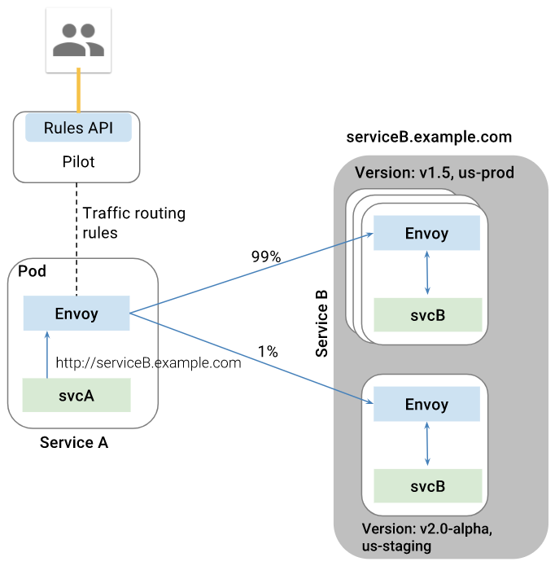

# Istio和Service Mesh

Istio是Google、IBM和Lyft联合开源的微服务 Service Mesh 框架，旨在解决大量微服务的发现、连接、管理、监控以及安全等问题。Istio对应用是透明的，不需要改动任何服务代码就可以实现透明的服务治理。

Istio的主要特性包括：

- HTTP、gRPC和TCP网络流量的自动负载均衡
- 丰富的路由规则，细粒度的网络流量行为控制
- 流量加密、服务间认证，以及强身份声明
- 全范围（Fleet-wide）策略执行
- 深度遥测和报告

## Istio原理

Istio从逻辑上可以分为数据平面和控制平面：

- 数据平面主要由一系列的智能代理（Envoy）组成，管理微服务之间的网络通信
- 控制平面负责管理和配置这些智能代理，并动态执行策略

Istio架构可以如下图所示


主要由以下组件构成

- [Envoy](https://lyft.github.io/envoy/)：Lyft开源的高性能代理总线，支持动态服务发现、负载均衡、TLS终止、HTTP/2和gPRC代理、健康检查、性能测量等功能。Envoy以sidecar的方式部署在相关的服务的Pod中。
- Mixer：负责访问控制、执行策略并从Envoy代理中收集遥测数据。Mixer支持灵活的插件模型，方便扩展（支持GCP、AWS、Prometheus、Heapster等多种后端）
- Istio-Auth：提供服务间和终端用户的认证机制
- Pilot：动态管理Envoy示例的生命周期，提供服务发现、流量管理、智能路由以及超时、熔断等弹性控制的功能。其与Envoy的关系如下图所示



在数据平面上，除了[Envoy](https://lyft.github.io/envoy/)，还可以选择使用 [nginxmesh](https://github.com/nginmesh/nginmesh) 和 [linkerd](https://linkerd.io/getting-started/istio/) 作为网络代理。比如，使用nginxmesh时，Istio的控制平面（Pilot、Mixer、Auth）保持不变，但用Nginx Sidecar取代Envoy：


## 安装

> 以下步骤假设 Kubernetes 集群已经部署并配置好了 kubectl 客户端。

### 下载Istio

```sh
curl -L https://git.io/getLatestIstio | sh -
ISTIO_VERSION=$(curl -L -s https://api.github.com/repos/istio/istio/releases/latest | jq -r .tag_name)
cd istio-${ISTIO_VERSION}
cp bin/istioctl /usr/local/bin
```

### 部署Istio服务

两种方式（选择其一执行）

- 禁止Auth：`kubectl apply -f install/kubernetes/istio.yaml`
- 启用Auth：`kubectl apply -f install/kubernetes/istio-auth.yaml`

部署完成后，可以检查 isotio-system namespace 中的服务是否正常运行：

```sh
$ kubectl -n istio-system get pod
NAME                             READY     STATUS    RESTARTS   AGE
istio-ca-5869f745dd-vdblc        1/1       Running   0          43s
istio-ingress-8458c655f5-9mc8f   1/1       Running   0          45s
istio-mixer-6f8d7c548-9bkqt      3/3       Running   0          1m
istio-pilot-6c96cc4859-cjx4b     2/2       Running   1          47s

$ kubectl -n istio-system get svc
NAME            TYPE           CLUSTER-IP       EXTERNAL-IP   PORT(S)                                                            AGE
istio-ingress   LoadBalancer   10.108.221.199   <pending>     80:31857/TCP,443:30803/TCP                                         53s
istio-mixer     ClusterIP      10.104.170.172   <none>        9091/TCP,15004/TCP,9093/TCP,9094/TCP,9102/TCP,9125/UDP,42422/TCP   1m
istio-pilot     ClusterIP      10.109.122.23    <none>        15003/TCP,8080/TCP,9093/TCP,443/TCP                                55s
```

### 部署Prometheus、Grafana和Zipkin插件

```sh
$ kubectl apply -f install/kubernetes/addons/
service "grafana" created
deployment "grafana" created
serviceaccount "grafana" created
configmap "prometheus" created
service "prometheus" created
deployment "prometheus" created
serviceaccount "prometheus" created
clusterrole "prometheus" created
clusterrolebinding "prometheus" created
deployment "servicegraph" created
service "servicegraph" created
deployment "zipkin-to-stackdriver" created
service "zipkin-to-stackdriver" created
deployment "zipkin" created
service "zipkin" created
```

等一会所有Pod启动后，可以通过 NodePort、负载均衡服务的外网 IP 或者 `kubectl proxy` 来访问这些服务。比如通过`kubectl proxy` 方式，先启动 kubectl proxy

```sh
$ kubectl proxy
Starting to serve on 127.0.0.1:8001
```

通过`http://localhost:8001/api/v1/namespaces/istio-system/services/grafana:3000/proxy/`访问Grafana服务


通过`http://localhost:8001/api/v1/namespaces/istio-system/services/servicegraph:8088/proxy/`访问ServiceGraph服务，展示服务之间调用关系图


通过`http://localhost:8001/api/v1/namespaces/istio-system/services/zipkin:9411/proxy/`访问Zipkin跟踪页面


通过`http://localhost:8001/api/v1/namespaces/istio-system/services/prometheus:9090/proxy/`访问Prometheus页面


## 部署示例应用

### 手动注入 sidecar 容器

在部署应用时，可以通过`istioctl kube-inject`给Pod手动插入Envoy sidecar 容器，即

```sh
wget https://raw.githubusercontent.com/istio/istio/master/blog/bookinfo-v1.yaml
# inject with istioctl
kubectl apply -f <(istioctl kube-inject -f bookinfo-v1.yaml)

# create ingress
cat <<EOF | kubectl create -f -
apiVersion: extensions/v1beta1
kind: Ingress
metadata:
 name: bookinfo
 annotations:
   kubernetes.io/ingress.class: "istio"
spec:
 rules:
 - http:
     paths:
     - path: /productpage
       backend:
         serviceName: productpage
         servicePort: 9080
     - path: /login
       backend:
         serviceName: productpage
         servicePort: 9080
     - path: /logout
       backend:
         serviceName: productpage
         servicePort: 9080
EOF
```

原始应用如下图所示


`istioctl kube-inject`在原始应用的每个Pod中插入了一个Envoy容器


服务启动后，可以通过Ingress地址`http://<ingress-address>/productpage`来访问BookInfo应用

```sh
$ kubectl describe ingress
Name:			gateway
Namespace:		default
Address:		192.168.0.77
Default backend:	default-http-backend:80 (10.8.0.4:8080)
Rules:
  Host	Path	Backends
  ----	----	--------
  *
    	/productpage 	productpage:9080 (<none>)
    	/login 		productpage:9080 (<none>)
    	/logout 	productpage:9080 (<none>)
Annotations:
Events:	<none>
```


### 自动注入 sidecar 容器

首先确认 `admissionregistration` API 已经开启：

```sh
$ kubectl api-versions | grep admissionregistration
admissionregistration.k8s.io/v1beta1
```

然后部署 istio-sidecar-injector

```sh
$ ./install/kubernetes/webhook-create-signed-cert.sh \
    --service istio-sidecar-injector \
    --namespace istio-system \
    --secret sidecar-injector-certs
$ kubectl apply -f install/kubernetes/istio-sidecar-injector-configmap-release.yaml
$ cat install/kubernetes/istio-sidecar-injector.yaml | \
     ./install/kubernetes/webhook-patch-ca-bundle.sh > \
     install/kubernetes/istio-sidecar-injector-with-ca-bundle.yaml
$ kubectl apply -f install/kubernetes/istio-sidecar-injector-with-ca-bundle.yaml

# Conform istio-sidecar-injector is working
$ kubectl -n istio-system get deployment -listio=sidecar-injector
Copy
NAME                     DESIRED   CURRENT   UP-TO-DATE   AVAILABLE   AGE
istio-sidecar-injector   1         1         1            1           1d
```

然手部署应用

```sh
# default namespace 没有 istio-injection 标签
$ kubectl get namespace -L istio-injection
NAME           STATUS        AGE       ISTIO-INJECTION
default        Active        1h        
istio-system   Active        1h        
kube-public    Active        1h        
kube-system    Active        1h

# 打上 istio-injection=enabled 标签
$ kubectl label namespace default istio-injection=enabled

# 在 default namespace 中创建 Pod 会自动添加 istio sidecar 容器
```

## 金丝雀部署

首先部署v2版本的应用，并配置默认路由到v1版本：

```sh
wget https://raw.githubusercontent.com/istio/istio/master/blog/bookinfo-ratings.yaml
kubectl apply -f <(istioctl kube-inject -f bookinfo-ratings.yaml)

wget https://raw.githubusercontent.com/istio/istio/master/blog/bookinfo-reviews-v2.yaml
kubectl apply -f <(istioctl kube-inject -f bookinfo-reviews-v2.yaml)

# create default route
cat <<EOF | istioctl create -f -
apiVersion: config.istio.io/v1alpha2
kind: RouteRule
metadata:
  name: reviews-default
spec:
  destination:
    name: reviews
  route:
  - labels:
      version: v1
    weight: 100
EOF
```

示例一：将 10% 请求发送到 v2 版本而其余 90% 发送到 v1 版本

```sh
cat <<EOF | istioctl create -f -
apiVersion: config.istio.io/v1alpha2
kind: RouteRule
metadata:
  name: reviews-default
spec:
  destination:
    name: reviews
  route:
  - labels:
      version: v2
    weight: 10
  - labels:
      version: v1
    weight: 90
EOF
```

示例二：将特定用户的请求全部发到 v2 版本

```sh

cat <<EOF | istioctl create -f -
apiVersion: config.istio.io/v1alpha2
kind: RouteRule
metadata:
 name: reviews-test-v2
spec:
 destination:
   name: reviews
 precedence: 2
 match:
   request:
     headers:
       cookie:
         regex: "^(.*?;)?(user=jason)(;.*)?$"
 route:
 - labels:
     version: v2
   weight: 100
EOF
```

示例三：全部切换到 v2 版本

```sh
cat <<EOF | istioctl replace -f -
apiVersion: config.istio.io/v1alpha2
kind: RouteRule
metadata:
  name: reviews-default
spec:
  destination:
    name: reviews
  route:
  - labels:
      version: v2
    weight: 100
EOF
```

示例四：限制并发访问

```sh
# configure a memquota handler with rate limits
cat <<EOF | istioctl create -f -
apiVersion: "config.istio.io/v1alpha2"
kind: memquota
metadata:
 name: handler
 namespace: default
spec:
 quotas:
 - name: requestcount.quota.default
   maxAmount: 5000
   validDuration: 1s
   overrides:
   - dimensions:
       destination: ratings
     maxAmount: 1
     validDuration: 1s
EOF

# create quota instance that maps incoming attributes to quota dimensions, and createrule that uses it with the memquota handler
cat <<EOF | istioctl create -f -
apiVersion: "config.istio.io/v1alpha2"
kind: quota
metadata:
 name: requestcount
 namespace: default
spec:
 dimensions:
   source: source.labels["app"] | source.service | "unknown"
   sourceVersion: source.labels["version"] | "unknown"
   destination: destination.labels["app"] | destination.service | "unknown"
   destinationVersion: destination.labels["version"] | "unknown"
---
apiVersion: "config.istio.io/v1alpha2"
kind: rule
metadata:
 name: quota
 namespace: default
spec:
 actions:
 - handler: handler.memquota
   instances:
   - requestcount.quota
EOF
```

为了查看访问次数限制的效果，可以使用 [wrk](https://github.com/wg/wrk) 给应用加一些压力：

```sh
export BOOKINFO_URL=$(kubectl get po -n istio-system -l istio=ingress -o jsonpath={.items[0].status.hostIP}):$(kubectl get svc -n istio-system istio-ingress -o jsonpath={.spec.ports[0].nodePort})
wrk -t1 -c1 -d20s http://$BOOKINFO_URL/productpage
```

## 参考文档

- <https://istio.io/>
- [Istio - A modern service mesh](https://istio.io/talks/istio_talk_gluecon_2017.pdf)
- <https://lyft.github.io/envoy/>
- <https://github.com/nginmesh/nginmesh>
- [WHAT’S A SERVICE MESH? AND WHY DO I NEED ONE?](https://buoyant.io/2017/04/25/whats-a-service-mesh-and-why-do-i-need-one/)
- [A SERVICE MESH FOR KUBERNETES](https://buoyant.io/2016/10/04/a-service-mesh-for-kubernetes-part-i-top-line-service-metrics/)
- [Service Mesh Pattern](http://philcalcado.com/2017/08/03/pattern_service_mesh.html)
- [Request Routing and Policy Management with the Istio Service Mesh](http://blog.kubernetes.io/2017/10/request-routing-and-policy-management.html)
