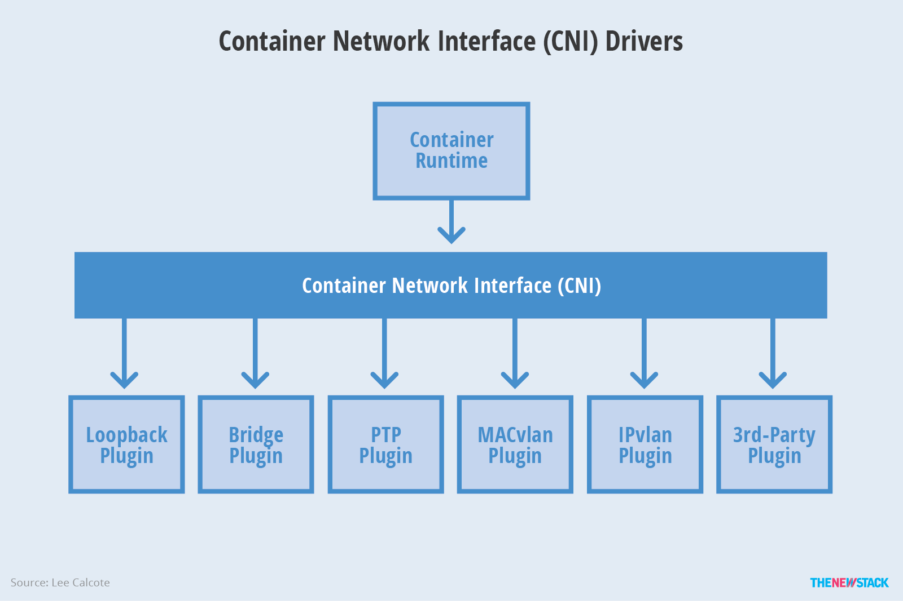
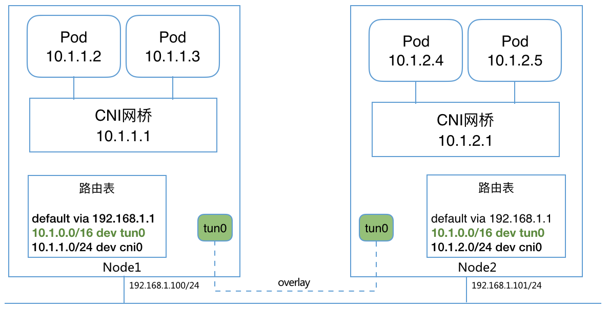

# CNI (Container Network Interface)

Container Network Interface (CNI) 最早是由CoreOS发起的容器网络规范，是Kubernetes网络插件的基础。其基本思想为：Container Runtime在创建容器时，先创建好network namespace，然后调用CNI插件为这个netns配置网络，其后再启动容器内的进程。现已加入CNCF，成为CNCF主推的网络模型。

CNI插件包括两部分：

- CNI Plugin负责给容器配置网络，它包括两个基本的接口
  - 配置网络: AddNetwork(net *NetworkConfig, rt *RuntimeConf) (types.Result, error)
  - 清理网络: DelNetwork(net *NetworkConfig, rt *RuntimeConf) error
- IPAM Plugin负责给容器分配IP地址，主要实现包括host-local和dhcp。

Kubernetes Pod 中的其他容器都是Pod所属pause容器的网络，创建过程为：

1. kubelet 先创建pause容器生成network namespace
2. 调用网络CNI driver
3. CNI driver 根据配置调用具体的cni 插件
4. cni 插件给pause 容器配置网络
5. pod 中其他的容器都使用 pause 容器的网络



所有CNI插件均支持通过环境变量和标准输入传入参数：

```sh
$ echo '{"cniVersion": "0.3.1","name": "mynet","type": "macvlan","bridge": "cni0","isGateway": true,"ipMasq": true,"ipam": {"type": "host-local","subnet": "10.244.1.0/24","routes": [{ "dst": "0.0.0.0/0" }]}}' | sudo CNI_COMMAND=ADD CNI_NETNS=/var/run/netns/a CNI_PATH=./bin CNI_IFNAME=eth0 CNI_CONTAINERID=a CNI_VERSION=0.3.1 ./bin/bridge

$ echo '{"cniVersion": "0.3.1","type":"IGNORED", "name": "a","ipam": {"type": "host-local", "subnet":"10.1.2.3/24"}}' | sudo CNI_COMMAND=ADD CNI_NETNS=/var/run/netns/a CNI_PATH=./bin CNI_IFNAME=a CNI_CONTAINERID=a CNI_VERSION=0.3.1 ./bin/host-local
```

常见的CNI网络插件有


**CNI Plugin Chains**

CNI还支持Plugin Chains，即指定一个插件列表，由Runtime依次执行每个插件。这对支持端口映射（portmapping）、虚拟机等非常有帮助。配置方法可以参考后面的[端口映射示例](#端口映射示例)。

## Bridge

Bridge是最简单的CNI网络插件，它首先在Host创建一个网桥，然后再通过veth pair连接该网桥到container netns。


注意：**Bridge模式下，多主机网络通信需要额外配置主机路由，或使用overlay网络**。可以借助[Flannel](../flannel/index.html)或者Quagga动态路由等来自动配置。比如overlay情况下的网络结构为



配置示例

```json
{
    "cniVersion": "0.3.0",
    "name": "mynet",
    "type": "bridge",
    "bridge": "mynet0",
    "isDefaultGateway": true,
    "forceAddress": false,
    "ipMasq": true,
    "hairpinMode": true,
    "ipam": {
        "type": "host-local",
        "subnet": "10.10.0.0/16"
    }
}
```

```
# export CNI_PATH=/opt/cni/bin
# ip netns add ns
# /opt/cni/bin/cnitool add mynet /var/run/netns/ns
{
    "interfaces": [
        {
            "name": "mynet0",
            "mac": "0a:58:0a:0a:00:01"
        },
        {
            "name": "vethc763e31a",
            "mac": "66:ad:63:b4:c6:de"
        },
        {
            "name": "eth0",
            "mac": "0a:58:0a:0a:00:04",
            "sandbox": "/var/run/netns/ns"
        }
    ],
    "ips": [
        {
            "version": "4",
            "interface": 2,
            "address": "10.10.0.4/16",
            "gateway": "10.10.0.1"
        }
    ],
    "routes": [
        {
            "dst": "0.0.0.0/0",
            "gw": "10.10.0.1"
        }
    ],
    "dns": {}
}
# ip netns exec ns ip addr
1: lo: <LOOPBACK> mtu 65536 qdisc noop state DOWN group default qlen 1
    link/loopback 00:00:00:00:00:00 brd 00:00:00:00:00:00
9: eth0@if8: <BROADCAST,MULTICAST,UP,LOWER_UP> mtu 1500 qdisc noqueue state UP group default
    link/ether 0a:58:0a:0a:00:04 brd ff:ff:ff:ff:ff:ff link-netnsid 0
    inet 10.10.0.4/16 scope global eth0
       valid_lft forever preferred_lft forever
    inet6 fe80::8c78:6dff:fe19:f6bf/64 scope link tentative dadfailed
       valid_lft forever preferred_lft forever
# ip netns exec ns ip route
default via 10.10.0.1 dev eth0
10.10.0.0/16 dev eth0  proto kernel  scope link  src 10.10.0.4
```

## IPAM

### DHCP

DHCP插件是最主要的IPAM插件之一，用来通过DHCP方式给容器分配IP地址，在macvlan插件中也会用到DHCP插件。

在使用DHCP插件之前，需要先启动dhcp daemon:

```sh
/opt/cni/bin/dhcp daemon &
```

然后配置网络使用dhcp作为IPAM插件

```json
{
    ...
    "ipam": {
        "type": "dhcp",
    }
}
```

### host-local

host-local是最常用的CNI IPAM插件，用来给container分配IP地址。

IPv4:

```json
{
	"ipam": {
		"type": "host-local",
		"subnet": "10.10.0.0/16",
		"rangeStart": "10.10.1.20",
		"rangeEnd": "10.10.3.50",
		"gateway": "10.10.0.254",
		"routes": [
			{ "dst": "0.0.0.0/0" },
			{ "dst": "192.168.0.0/16", "gw": "10.10.5.1" }
		],
		"dataDir": "/var/my-orchestrator/container-ipam-state"
	}
}
```

IPv6:

```json
{
  "ipam": {
		"type": "host-local",
		"subnet": "3ffe:ffff:0:01ff::/64",
		"rangeStart": "3ffe:ffff:0:01ff::0010",
		"rangeEnd": "3ffe:ffff:0:01ff::0020",
		"routes": [
			{ "dst": "3ffe:ffff:0:01ff::1/64" }
		],
		"resolvConf": "/etc/resolv.conf"
	}
}
```

## ptp

ptp插件通过veth pair给容器和host创建点对点连接：veth pair一端在container netns内，另一端在host上。可以通过配置host端的IP和路由来让ptp连接的容器之前通信。

```json
{
	"name": "mynet",
	"type": "ptp",
	"ipam": {
		"type": "host-local",
		"subnet": "10.1.1.0/24"
	},
	"dns": {
		"nameservers": [ "10.1.1.1", "8.8.8.8" ]
	}
}
```

## IPVLAN

IPVLAN 和 MACVLAN 类似，都是从一个主机接口虚拟出多个虚拟网络接口。一个重要的区别就是所有的虚拟接口都有相同的 mac 地址，而拥有不同的 ip 地址。因为所有的虚拟接口要共享 mac 地址，所以有些需要注意的地方：

- DHCP 协议分配 ip 的时候一般会用 mac 地址作为机器的标识。这个情况下，客户端动态获取 ip 的时候需要配置唯一的 ClientID 字段，并且 DHCP server 也要正确配置使用该字段作为机器标识，而不是使用 mac 地址

IPVLAN支持两种模式：

- L2 模式：此时跟macvlan bridge 模式工作原理很相似，父接口作为交换机来转发子接口的数据。同一个网络的子接口可以通过父接口来转发数据，而如果想发送到其他网络，报文则会通过父接口的路由转发出去。
- L3 模式：此时ipvlan 有点像路由器的功能，它在各个虚拟网络和主机网络之间进行不同网络报文的路由转发工作。只要父接口相同，即使虚拟机/容器不在同一个网络，也可以互相 ping 通对方，因为 ipvlan 会在中间做报文的转发工作。注意 L3 模式下的虚拟接口 不会接收到多播或者广播的报文（这个模式下，所有的网络都会发送给父接口，所有的 ARP 过程或者其他多播报文都是在底层的父接口完成的）。另外外部网络默认情况下是不知道 ipvlan 虚拟出来的网络的，如果不在外部路由器上配置好对应的路由规则，ipvlan 的网络是不能被外部直接访问的。

创建ipvlan的简单方法为

```
ip link add link <master-dev> <slave-dev> type ipvlan mode { l2 | L3 }
```

cni配置格式为

```
{
    "name": "mynet",
    "type": "ipvlan",
    "master": "eth0",
    "ipam": {
        "type": "host-local",
        "subnet": "10.1.2.0/24"
    }
}
```

需要注意的是

- ipvlan插件下，容器不能跟Host网络通信
- 主机接口（也就是master interface）不能同时作为ipvlan和macvlan的master接口

## MACVLAN

MACVLAN可以从一个主机接口虚拟出多个macvtap，且每个macvtap设备都拥有不同的mac地址（对应不同的linux字符设备）。MACVLAN支持四种模式

- bridge模式：数据可以在同一master设备的子设备之间转发
- vepa模式：VEPA 模式是对 802.1Qbg 标准中的 VEPA 机制的软件实现，MACVTAP 设备简单的将数据转发到master设备中，完成数据汇聚功能，通常需要外部交换机支持 Hairpin 模式才能正常工作
- private模式：Private 模式和 VEPA 模式类似，区别是子 MACVTAP 之间相互隔离
- passthrough模式：内核的 MACVLAN 数据处理逻辑被跳过，硬件决定数据如何处理，从而释放了 Host CPU 资源

创建macvlan的简单方法为

```sh
ip link add link <master-dev> name macvtap0 type macvtap
```

cni配置格式为

```
{
	"name": "mynet",
	"type": "macvlan",
	"master": "eth0",
	"ipam": {
		"type": "dhcp"
	}
}
```

需要注意的是

- macvlan需要大量 mac 地址，每个虚拟接口都有自己的 mac 地址
- 无法和 802.11(wireless) 网络一起工作
- 主机接口（也就是master interface）不能同时作为ipvlan和macvlan的master接口

## [Flannel](../flannel/index.md)

[Flannel](https://github.com/coreos/flannel)通过给每台宿主机分配一个子网的方式为容器提供虚拟网络，它基于Linux TUN/TAP，使用UDP封装IP包来创建overlay网络，并借助etcd维护网络的分配情况。

## [Weave Net](../weave/index.md)

Weave Net是一个多主机容器网络方案，支持去中心化的控制平面，各个host上的wRouter间通过建立Full Mesh的TCP链接，并通过Gossip来同步控制信息。这种方式省去了集中式的K/V Store，能够在一定程度上减低部署的复杂性，Weave将其称为“data centric”，而非RAFT或者Paxos的“algorithm centric”。

数据平面上，Weave通过UDP封装实现L2 Overlay，封装支持两种模式，一种是运行在user space的sleeve mode，另一种是运行在kernal space的 fastpath mode。Sleeve mode通过pcap设备在Linux bridge上截获数据包并由wRouter完成UDP封装，支持对L2 traffic进行加密，还支持Partial Connection，但是性能损失明显。Fastpath mode即通过OVS的odp封装VxLAN并完成转发，wRouter不直接参与转发，而是通过下发odp 流表的方式控制转发，这种方式可以明显地提升吞吐量，但是不支持加密等高级功能。

## [Contiv](../contiv/index.md)

[Contiv](http://contiv.github.io)是思科开源的容器网络方案，主要提供基于Policy的网络管理，并与主流容器编排系统集成。Contiv最主要的优势是直接提供了多租户网络，并支持L2(VLAN), L3(BGP), Overlay (VXLAN)以及思科自家的ACI。

## [Calico](../calico/index.md)

[Calico](https://www.projectcalico.org/) 是一个基于BGP的纯三层的数据中心网络方案（不需要Overlay），并且与OpenStack、Kubernetes、AWS、GCE等IaaS和容器平台都有良好的集成。

Calico在每一个计算节点利用Linux Kernel实现了一个高效的vRouter来负责数据转发，而每个vRouter通过BGP协议负责把自己上运行的workload的路由信息像整个Calico网络内传播——小规模部署可以直接互联，大规模下可通过指定的BGP route reflector来完成。 这样保证最终所有的workload之间的数据流量都是通过IP路由的方式完成互联的。Calico节点组网可以直接利用数据中心的网络结构（无论是L2或者L3），不需要额外的NAT，隧道或者Overlay Network。

此外，Calico基于iptables还提供了丰富而灵活的网络Policy，保证通过各个节点上的ACLs来提供Workload的多租户隔离、安全组以及其他可达性限制等功能。

## [OVN](../ovn-kubernetes.md)

[OVN (Open Virtual Network)](http://openvswitch.org/support/dist-docs/ovn-architecture.7.html) 是OVS提供的原生虚拟化网络方案，旨在解决传统SDN架构（比如Neutron DVR）的性能问题。

OVN为Kubernetes提供了两种网络方案：

* Overaly: 通过ovs overlay连接容器
* Underlay: 将VM内的容器连到VM所在的相同网络（开发中）

其中，容器网络的配置是通过OVN的CNI插件来实现。

## SR-IOV

Intel维护了一个SR-IOV的[CNI插件](https://github.com/Intel-Corp/sriov-cni)，fork自[hustcat/sriov-cni](https://github.com/hustcat/sriov-cni)，并扩展了DPDK的支持。

项目主页见<https://github.com/Intel-Corp/sriov-cni>。

## [Romana](../romana/index.md)

Romana是Panic Networks在2016年提出的开源项目，旨在借鉴 route aggregation的思路来解决Overlay方案给网络带来的开销。

## [OpenContrail](../opencontrail/index.md)

OpenContrail是Juniper推出的开源网络虚拟化平台，其商业版本为Contrail。其主要由控制器和vRouter组成：

* 控制器提供虚拟网络的配置、控制和分析功能
* vRouter提供分布式路由，负责虚拟路由器、虚拟网络的建立以及数据转发

其中，vRouter支持三种模式

* Kernel vRouter：类似于ovs内核模块
* DPDK vRouter：类似于ovs-dpdk
* Netronome Agilio Solution (商业产品)：支持DPDK, SR-IOV and Express Virtio (XVIO)

[michaelhenkel/opencontrail-cni-plugin](https://github.com/michaelhenkel/opencontrail-cni-plugin)提供了一个OpenContrail的CNI插件。

### Network Configuration Lists

[CNI SPEC](https://github.com/containernetworking/cni/blob/master/SPEC.md#network-configuration-lists) 支持指定网络配置列表，包含多个网络插件，由 Runtime 依次执行。注意

- ADD 操作，按顺序依次调用每个插件；而 DEL 操作调用顺序相反
- ADD 操作，除最后一个插件，前面每个插件需要增加 `prevResult` 传递给其后的插件
- 第一个插件必须要包含 ipam 插件

### 端口映射示例

下面的例子展示了 bridge+[portmap](https://github.com/containernetworking/plugins/tree/master/plugins/meta/portmap) 插件的用法。

首先，配置 CNI 网络使用 bridge+portmap 插件：

```sh
# cat /root/mynet.conflist
{
  "name": "mynet",
  "cniVersion": "0.3.0",
  "plugins": [
    {
      "type": "bridge",
      "bridge": "mynet",
      "ipMasq": true,
      "isGateway": true,
      "ipam": {
      "type": "host-local",
      "subnet": "10.244.10.0/24",
      "routes": [
          {"dst": "0.0.0.0/0"}
      ]
      }
    },
    {
       "type": "portmap",
       "capabilities": {"portMappings": true}
    }
  ]
}
```

然后通过 `CAP_ARGS` 设置端口映射参数：

```sh
# export CAP_ARGS='{
    "portMappings": [
        {
            "hostPort":      9090,
            "containerPort": 80,
            "protocol":      "tcp",
            "hostIP":        "127.0.0.1"
        }
    ]
}'
```

测试添加网络接口：

```sh
# ip netns add test
# CNI_PATH=/opt/cni/bin NETCONFPATH=/root ./cnitool add mynet /var/run/netns/test
{
    "interfaces": [
        {
            "name": "mynet",
            "mac": "0a:58:0a:f4:0a:01"
        },
        {
            "name": "veth2cfb1d64",
            "mac": "4a:dc:1f:b7:56:b1"
        },
        {
            "name": "eth0",
            "mac": "0a:58:0a:f4:0a:07",
            "sandbox": "/var/run/netns/test"
        }
    ],
    "ips": [
        {
            "version": "4",
            "interface": 2,
            "address": "10.244.10.7/24",
            "gateway": "10.244.10.1"
        }
    ],
    "routes": [
        {
            "dst": "0.0.0.0/0"
        }
    ],
    "dns": {}
}
```

可以从 iptables 规则中看到添加的规则：

```sh
# iptables-save | grep 10.244.10.7
-A CNI-DN-be1eedf7a76853f303ebd -d 127.0.0.1/32 -p tcp -m tcp --dport 9090 -j DNAT --to-destination 10.244.10.7:80
-A CNI-SN-be1eedf7a76853f303ebd -s 127.0.0.1/32 -d 10.244.10.7/32 -p tcp -m tcp --dport 80 -j MASQUERADE
```

最后，清理网络接口：

```
# CNI_PATH=/opt/cni/bin NETCONFPATH=/root ./cnitool del mynet /var/run/netns/test
```

## 其他

### [Canal](https://github.com/tigera/canal)

[Canal](https://github.com/tigera/canal)是Flannel和Calico联合发布的一个统一网络插件，提供CNI网络插件，并支持network policy。

### [kuryr-kubernetes](https://github.com/openstack/kuryr-kubernetes)

[kuryr-kubernetes](https://github.com/openstack/kuryr-kubernetes)是OpenStack推出的集成Neutron网络插件，主要包括Controller和CNI插件两部分，并且也提供基于Neutron LBaaS的Service集成。

### [Cilium](https://github.com/cilium/cilium)

[Cilium](https://github.com/cilium/cilium)是一个基于eBPF和XDP的高性能容器网络方案，提供了CNI和CNM插件。

项目主页为<https://github.com/cilium/cilium>。

## [CNI-Genie](https://github.com/Huawei-PaaS/CNI-Genie)

[CNI-Genie](https://github.com/Huawei-PaaS/CNI-Genie)是华为PaaS团队推出的同时支持多种网络插件（支持calico, canal, romana, weave等）的CNI插件。

项目主页为<https://github.com/Huawei-PaaS/CNI-Genie>。
