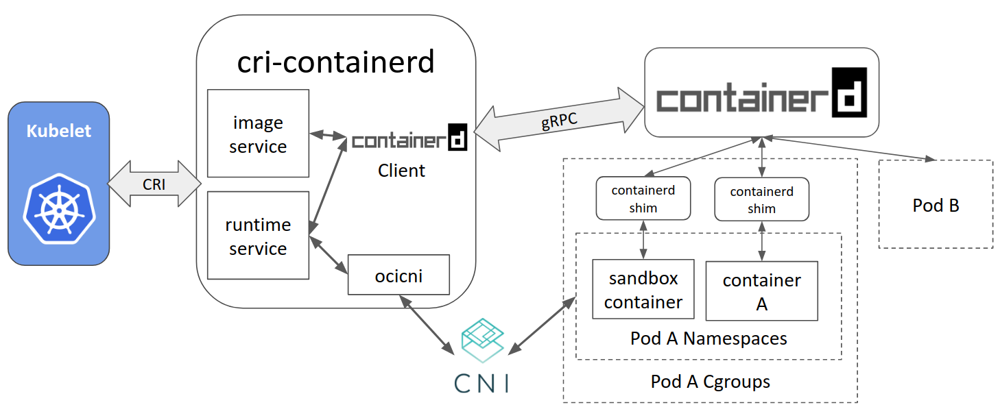

# Container Runtime Interface

Container Runtime Interface（CRI）是 Kubernetes v1.5 引入的容器运行时接口，它将 Kubelet 与容器运行时解耦，将原来完全面向 Pod 级别的内部接口拆分成面向 Sandbox 和 Container 的 gRPC 接口，并将镜像管理和容器管理分离到不同的服务。


CRI 最早从从 1.4 版就开始设计讨论和开发，在 v1.5 中发布第一个测试版。在 v1.6 时已经有了很多外部容器运行时，如 frakti 和 cri-o 等。v1.7 中又新增了 cri-containerd 支持用 Containerd 来管理容器。

## CRI 接口

CRI 基于 gRPC 定义了 RuntimeService 和 ImageService 等两个 gRPC 服务，分别用于容器运行时和镜像的管理。其定义在

- v1.10-v1.11: [pkg/kubelet/apis/cri/runtime/v1alpha2](https://github.com/kubernetes/kubernetes/tree/master/pkg/kubelet/apis/cri/runtime/v1alpha2)
- v1.7-v1.9: [pkg/kubelet/apis/cri/v1alpha1/runtime](https://github.com/kubernetes/kubernetes/tree/release-1.9/pkg/kubelet/apis/cri/v1alpha1/runtime)
- v1.6: [pkg/kubelet/api/v1alpha1/runtime](https://github.com/kubernetes/kubernetes/tree/release-1.6/pkg/kubelet/api/v1alpha1/runtime)

Kubelet 作为 CRI 的客户端，而容器运行时则需要实现 CRI 的服务端（即 gRPC server，通常称为 CRI shim）。容器运行时在启动 gRPC server 时需要监听在本地的 Unix Socket （Windows 使用 tcp 格式）。

### 开发 CRI 容器运行时

开发新的容器运行时只需要实现 CRI 的 gRPC Server，包括 RuntimeService 和 ImageService。该 gRPC Server 需要监听在本地的 unix socket（Linux 支持 unix socket 格式，Windows 支持 tcp 格式）。

一个简单的示例为

```go
import (
    // Import essential packages
	"google.golang.org/grpc"
	runtime "k8s.io/kubernetes/pkg/kubelet/apis/cri/runtime/v1alpha2"
)

// Serivice implements runtime.ImageService and runtime.RuntimeService.
type Service struct {
    ...
}

func main() {
    service := &Service{}
    s := grpc.NewServer(grpc.MaxRecvMsgSize(maxMsgSize),
		grpc.MaxSendMsgSize(maxMsgSize))
    runtime.RegisterRuntimeServiceServer(s, service)
    runtime.RegisterImageServiceServer(s, service)
    lis, err := net.Listen("unix", "/var/run/runtime.sock")
    if err != nil {
        logrus.Fatalf("Failed to create listener: %v", err)
    }
    go s.Serve(lis)
    
    // Other codes
}
```

详细的实现方法可以参考 [dockershim](https://github.com/kubernetes/kubernetes/tree/master/pkg/kubelet/dockershim) 或者 [cri-o](https://github.com/kubernetes-incubator/cri-o)。

### Kubelet 配置

在启动 kubelet 时传入容器运行时监听的 Unix Socket 文件路径，比如

```sh
kubelet --container-runtime=remote --container-runtime-endpoint=unix:///var/run/runtime.sock --image-service-endpoint=unix:///var/run/runtime.sock
```

## 容器运行时

目前基于 CRI 容器引擎已经比较丰富了，包括

- Docker: 核心代码依然保留在 kubelet 内部（[pkg/kubelet/dockershim](https://github.com/kubernetes/kubernetes/tree/master/pkg/kubelet/dockershim)），是最稳定和特性支持最好的运行时
- OCI 容器运行时：
  - 社区有两个实现
    - [Containerd](https://github.com/containerd/cri)，支持 kubernetes v1.7+
    - [CRI-O](https://github.com/kubernetes-incubator/cri-o)，支持 Kubernetes v1.6+
  - 支持的 OCI 容器引擎包括
    - [runc](https://github.com/opencontainers/runc)：OCI 标准容器引擎
    - [gVisor](https://github.com/google/gvisor)：谷歌开源的基于用户空间内核的沙箱容器引擎
    - [Clear Containers](https://github.com/clearcontainers/runtime)：Intel 开源的基于虚拟化的容器引擎
    - [Kata Containers](https://github.com/kata-containers/runtime)：基于虚拟化的容器引擎，由 Clear Containers 和 runV 合并而来
- [PouchContainer](https://github.com/alibaba/pouch)：阿里巴巴开源的胖容器引擎
- [Frakti](https://github.com/kubernetes/frakti)：支持 Kubernetes v1.6+，提供基于 hypervisor 和 docker 的混合运行时，适用于运行非可信应用，如多租户和 NFV 等场景
- [Rktlet](https://github.com/kubernetes-incubator/rktlet)：支持 [rkt](https://github.com/rkt/rkt) 容器引擎
- [Virtlet](https://github.com/Mirantis/virtlet)：Mirantis 开源的虚拟机容器引擎，直接管理 libvirt 虚拟机，镜像须是 qcow2 格式
- [Infranetes](https://github.com/apporbit/infranetes)：直接管理 IaaS 平台虚拟机，如 GCE、AWS 等

### Containerd

以 Containerd 为例，在 1.0 及以前版本将 dockershim 和 docker daemon 替换为 cri-containerd + containerd，而在 1.1 版本直接将 cri-containerd 内置在 Containerd中，简化为一个 CRI 插件。


Containerd 内置的 CRI 插件实现了 Kubelet CRI 接口中的 Image Service 和 Runtime Service，通过内部接口管理容器和镜像，并通过 CNI 插件给 Pod 配置网络。



## cri-tools

通常，容器引擎会提供一个命令行工具来帮助用户调试容器应用并简化故障排错。比如使用 Docker 作为容器运行时的时候，可以使用 `docker` 命令来查看容器和镜像的状态，并验证容器的配置是否正确。但在使用其他容器引擎时，推荐使用 `crictl` 来替代 `docker` 工具。

`crictl` 是  [cri-tools](https://github.com/kubernetes-incubator/cri-tools) 的一部分，它提供了类似于 docker 的命令行工具，不需要通过 Kubelet 就可以通过 CRI 跟容器运行时通信。它是专门为 Kubernetes 设计的，提供了Pod、容器和镜像等资源的管理命令，可以帮助用户和开发者调试容器应用或者排查异常问题。`crictl` 可以用于所有实现了 CRI 接口的容器运行时。

注意，`crictl` 并非 `kubectl` 的替代品，它只通过 CRI 接口与容器运行时通信，可以用来调试和排错，但并不用于运行容器。虽然 crictl 也提供运行 Pod 和容器的子命令，但这些命令仅推荐用于调试。需要注意的是，如果是在 Kubernetes Node 上面创建了新的 Pod，那么它们会被 Kubelet 停止并删除。

除了 `crictl`，cri-tools 还提供了用于验证容器运行时是否实现 CRI 需要功能的验证测试工具 `critest`。`critest` 通过运行一系列的测试验证容器运行时在实现 CRI 时是否与 Kubelet 的需求一致，推荐所有的容器运行时在发布前都要通过其测试。一般情况下，`critest` 可以作为容器运行时集成测试的一部分，用以保证代码更新不会破坏 CRI 功能。